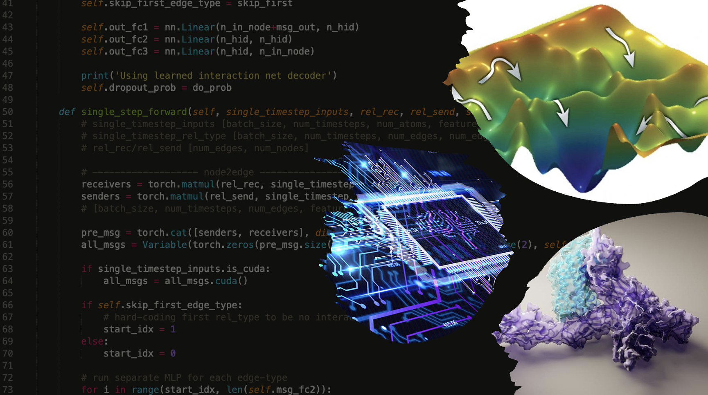
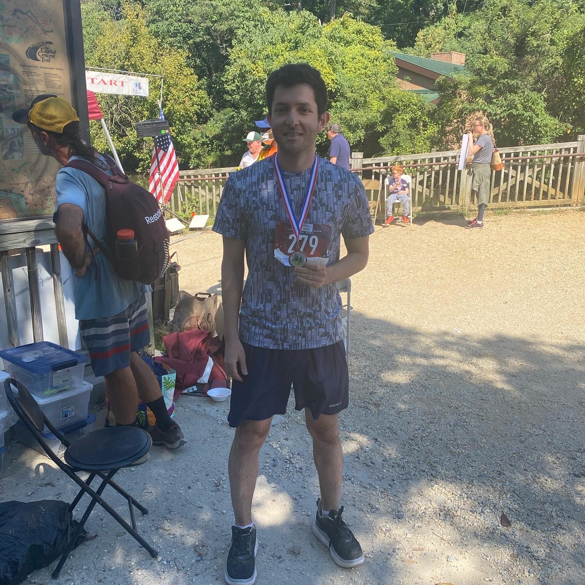

I am a fifth-year PhD student of Chemical and Biomolecular Engineering at the University of Maryland working with Prof. Klauda ([Klauda lab](https://terpconnect.umd.edu/~jbklauda/)). Since June 2019 I started to work at the National Institute of Health, NIH, with Prof. Brooks ([Brooks lab](https://www.lobos.nih.gov/cbs/)) as a pre-Doctral IRTA fellow. My research interest is applying statistical mechanics and machine learning approaches to biological systems and understand complex processes such as protein folding. 

Besides science I enjoy running. Here is a picture of me in my last marathon (Oct 2021). 

I am going to run my next marathon in May and hopefully I will improve my record to be under four hours. 🏃‍♂️

