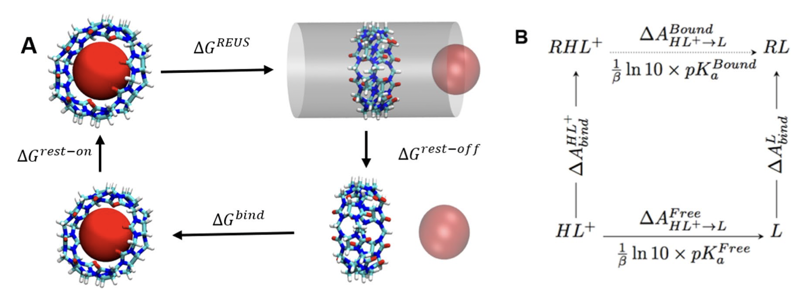

My research in my PhD with short description:

- ***GraphVAMPNet, using graph neural network and variational approach to mark processes for dynamical modeling of biomolecules***
 
  Recently, an unsupervised machine learning technique called VAMPNet was introduced to learn the low dimensional representation and linear dynamical model in an end-to-end manner. VAMPNet is based on variational approach to Markov processes (VAMP) and relies on neural networks to learn the coarse-grained dynamics. In this contribution, we combine VAMPNet and graph neural networks to generate an end-to-end framework to efficiently learn high-level dynamics and metastable states from the long-timescale molecular dynamics trajectories. This method bears the advantages of graph representation learning and uses graph message passing operations to generate an embedding for each datapoint which is used in the VAMPNet to generate a coarse-grained representation. This type of molecular representation results in a higher resolution and more interpretable Markov model than the standard VAMPNet enabling a more detailed kinetic study of the biomolecular processes. Our GraphVAMPNet approach is also enhanced with an attention mechanism to find the important residues for classification into different metastable states.

- ***Gaussian mixture variatioanal autoencoder for clustering and dimensionality reduction of protein folding***

 Dimensionality reduction methods are required for extracting useful information about molecular processes from protein folding trajectories. Here, I use a machine learning method, Gaussian mixture variational autoencoder (GMVAE) to simultaneously perform dimensionality reduction and clustering of MD trajectories. GMVAE can learn a reduced representation of free energy landscape of protein folding with highly separated clusters that correspond to the metastable states during folding. Find out more [here](https://aip.scitation.org/doi/pdf/10.1063/5.0069708)

 -   ***Dynamics and Network analysis of spike protein in SARS-COV-2***

The spike protein in SARS-COV-2 resinding on virion's surface mediates its entry into host cells by binding its RBD to host cell protein ACE2. In the first part of this project we mapped structural differences in cantact between RBD of SARS-COV-2 with ACE2 and RBD of an earlier coronavirus SARS-COV through molecular dynamics simulations and binding free energy calculations. A stronger binding affinity for SARS-COV-2 to ACE2 leads to higher infection rate than SARS-COV which is due to the observed mutations in the RBD. Our detailed analysis revealed critical residues for binding. Find more about this research [here](https://scholar.google.com/citations?view_op=view_citation&hl=en&user=IUKI5m0AAAAJ&citation_for_view=IUKI5m0AAAAJ:2osOgNQ5qMEC)

A glycan shield on the spike protein helps the virus evade the human immune response by providing a thick barrier agains antibodies. In the next part of this project, we studied dynamic motion of glycans in the spike protein through microsecond-long MD simulations in different states of RBD. A network anallysis on the glycans revealed the importance of different regions and microdomains of glycans for an effective shielding agains incoming antibodies. Find more information [here](https://www.sciencedirect.com/science/article/pii/S0006349521002101)

-   ***Permeability calculation through membranes using molecular dynamics and diffusion models***

Permeation of small molecules through membrane is of fundamental importance for many biological processes. Here permeabilities are calculated and compared with two approaches based on Fick's first law and the inhomogenous solubility-diffusion model. We showed that the free energy and diffusion profiles for ethanol through POPC membrane lacks accuracy at higher permeant concentration due to non-Markovian kinetics caused by collective behavior. In contrast, counting method provides unbiased estimates. Finally, we showed that permeabilities obtained from single bilayer simulations can be combined to represent a natural gradient concentration felt by a cellular membrane which accurately models the non-equilibrium efffects of ethanol permeability from single bilayer simulations in equilibrium. 

-  ***A replica exchange umbrella sampling (REUS) approach to predict host–guest binding free energies in SAMPL8 challenge***

In this study, we report binding free energy calculations of various drugs-of-abuse to Cucurbit-[8]-uril as part of the SAMPL8 blind challenge. Force-field parameters were obtained from force-matching with different quantum mechanical levels of theory. The Replica Exchange Umbrella Sampling (REUS) approach was used with a cylindrical restraint to enhance the sampling of host–guest binding. Binding free energy was calculated by pulling the guest molecule from one side of the symmetric and cylindrical host, then into and through the host, and out the other side (bidirectional) as compared to pulling only to the bound pose inside the cylindrical host (unidirectional). 

 
 
