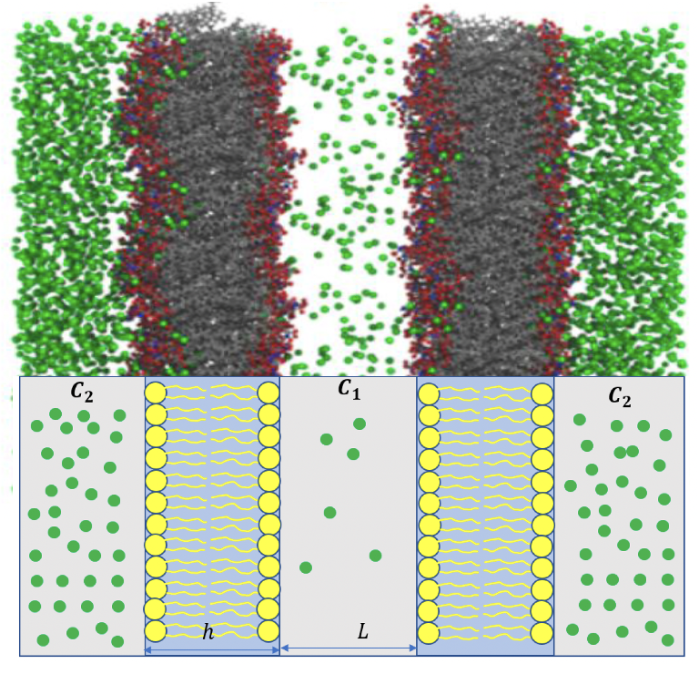
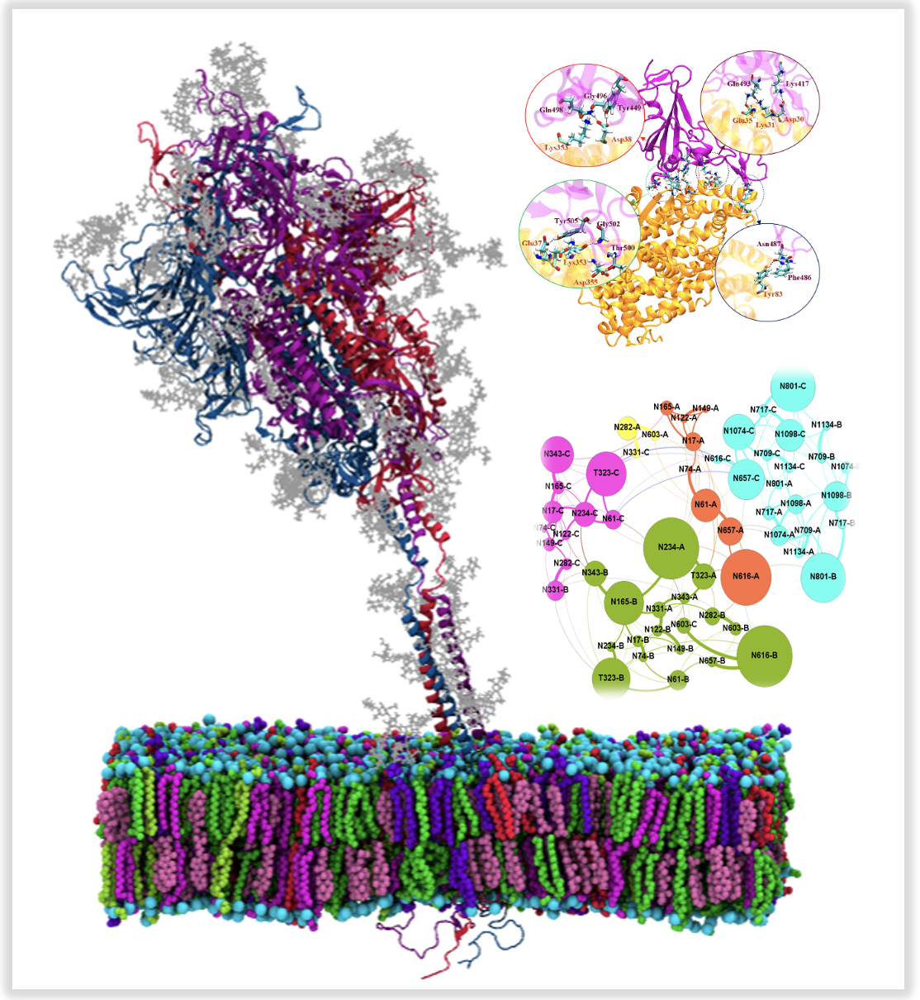
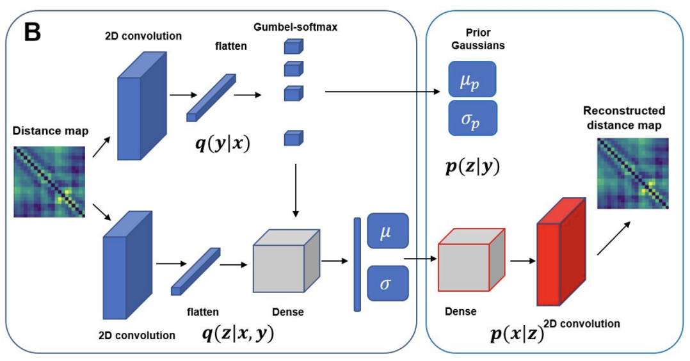
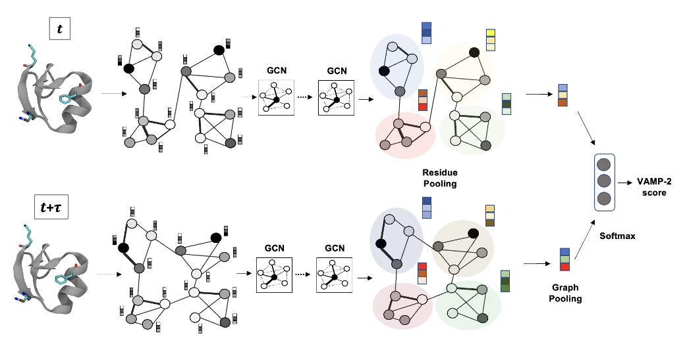

My research in my PhD with short description:

-   ***Permeability calculation through membranes using molecular dynamics and diffusion models***

Permeation of small molecules through membrane is of fundamental importance for many biological processes. Here permeabilities are calculated and compared with two approaches based on Fick's first law and the inhomogenous solubility-diffusion model. We showed that the free energy and diffusion profiles for ethanol through POPC membrane lacks accuracy at higher permeant concentration due to non-Markovian kinetics caused by collective behavior. In contrast, counting method provides unbiased estimates. Finally, we showed that permeabilities obtained from single bilayer simulations can be combined to represent a natural gradient concentration felt by a cellular membrane which accurately models the non-equilibrium efffects of ethanol permeability from single bilayer simulations in equilibrium. 

-   ***Dynamics and Network analysis of spike protein in SARS-COV-2***

The spike protein in SARS-COV-2 resinding on virion's surface mediates its entry into host cells by binding its RBD to host cell protein ACE2. In the first part of this project we mapped structural differences in cantact between RBD of SARS-COV-2 with ACE2 and RBD of an earlier coronavirus SARS-COV through molecular dynamics simulations and binding free energy calculations. A stronger binding affinity for SARS-COV-2 to ACE2 leads to higher infection rate than SARS-COV which is due to the observed mutations in the RBD. Our detailed analysis revealed critical residues for binding. Find more about this research [here](https://scholar.google.com/citations?view_op=view_citation&hl=en&user=IUKI5m0AAAAJ&citation_for_view=IUKI5m0AAAAJ:2osOgNQ5qMEC)

A glycan shield on the spike protein helps the virus evade the human immune response by providing a thick barrier agains antibodies. In the next part of this project, we studied dynamic motion of glycans in the spike protein through microsecond-long MD simulations in different states of RBD. A network anallysis on the glycans revealed the importance of different regions and microdomains of glycans for an effective shielding agains incoming antibodies. Find more information [here](https://www.sciencedirect.com/science/article/pii/S0006349521002101)

-  ***Gaussian mixture variatioanal autoencoder for clustering and dimensionality reduction of protein folding***

Dimensionality reduction methods are required for extracting useful information about molecular processes from protein folding trajectories. Here, I use a machine learning method, Gaussian mixture variational autoencoder (GMVAE) to simultaneously perform dimensionality reduction and clustering of MD trajectories. GMVAE can learn a reduced representation of free energy landscape of protein folding with highly separated clusters that correspond to the metastable states during folding. Find out more [here](https://aip.scitation.org/doi/pdf/10.1063/5.0069708)

-  ***GraphVAMPNet, using graph neural network and variational approach to mark processes for dynamical modeling of biomolecules***

